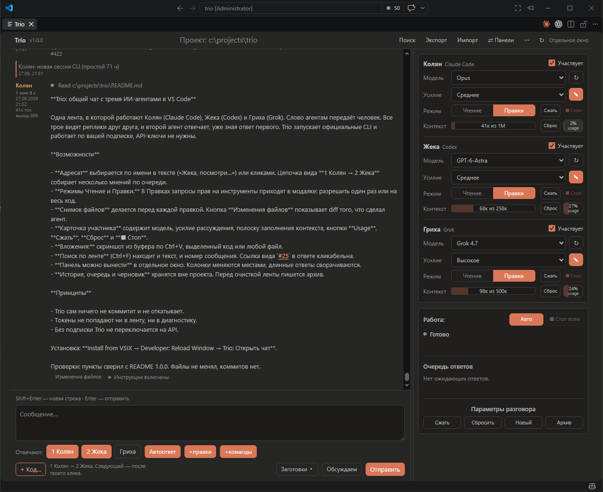

# Trio

**Общий чат с тремя ИИ-агентами прямо в VS Code.**
Колян (Claude Code), Жека (Codex) и Гриха (Grok) работают в одной ленте,
видят реплики друг друга и отвечают по очереди. Слово передаёт человек.



Trio запускает официальные CLI агентов и работает через ту же подписку, что и они.
API-ключи не нужны, модели Trio напрямую не вызывает.

## Возможности

**Разговор**

- Адресат выбирается по имени в тексте («Жека, посмотри проект») или кликами
  в строке **Отвечают**.
- Цепочка **1 Колян → 2 Жека** собирает несколько мнений: второй получает вопрос
  и уже опубликованный ответ первого.
- Каждый следующий ответ запускается кнопкой в **очереди ответов**, агенты
  не перебивают друг друга. С флагом **Автоответ** очередь идёт сама.
  Ответ встаёт в ленте сразу за своим вопросом.
- Номера сообщений: `#25` — вопрос Антона, `#К76` — Колян, `#Ж34` — Жека,
  `#Г120` — Гриха. Поиск открывает реплику, тот же номер в тексте — ссылка.
  У ответа есть ссылка «На вопрос #номер».
- Поиск по ленте (Ctrl+F), свёртка длинных ответов, вынос панели в отдельное окно.

**Работа с кодом**

- Режимы **Чтение** и **Правки** для каждого агента. В Чтении запросы
  на инструменты отклоняются. В Правках Trio спрашивает разрешение:
  один раз или на весь ход.
- Перед Правками делается снимок файлов. **Изменения файлов** показывает diff
  того, что сделал агент.
- **+ Код…** прикладывает выделение, открытый или любой другой файл.
  Скриншот из буфера вставляется по Ctrl+V.
- Trio сам ничего не коммитит и не откатывает.

**Контроль агентов**

- В карточке участника: модель, усилие рассуждения, полоска заполнения
  контекста.
- **Usage** показывает расход подписки: тариф, лимиты, окно контекста.
- **Сжать** просит движок сжать свою историю. **Сброс** начинает новую
  сессию CLI, лента при этом остаётся.
- **■ Стоп** есть у каждого агента и общий. То же текстом: «Жека, стоп»,
  «стоп всем».

**Хранение**

- История, вложения, черновик и сессии лежат в хранилище расширения,
  вне проекта.
- Перед очисткой ленты пишется JSON-архив.
- Снимки файлов дедуплицируются. Общий лимит на все проекты по умолчанию
  1 ГиБ, старые снимки вытесняются.

## Установка

1. Скачай `trio-chat-*.vsix` со страницы
   [последнего релиза](https://github.com/Avmbur/Trio/releases/latest).
2. В VS Code выполни **Extensions: Install from VSIX…** и выбери файл.
3. **Developer: Reload Window** через Ctrl+Shift+P.
4. Открой папку проекта и выполни **Trio: Открыть чат**.

В шапке панели должна быть видна версия **v1.0.6**.

### Что нужно для работы

| Агент | CLI | Вход |
|---|---|---|
| Колян | Claude Code | подписка Claude, вход через CLI или расширение |
| Жека | Codex (App Server) | подписка ChatGPT, вход через CLI или расширение |
| Гриха | Grok Build (ACP) | один раз `grok login` в терминале |

CLI Claude Code и Codex Trio находит в их официальных расширениях VS Code,
затем в PATH. Grok ищется в `%USERPROFILE%\.grok\bin\grok.exe`. Пути можно
задать вручную: меню **⋯ → CLI**.

Достаточно одного агента, остальных можно выключить галочкой **Участвует**.

## Настройки

Меню **⋯**: **Настройки плагина**, **CLI**, **Диагностика** и **От создателя**.
Диагностика показывает найденные пути и версии CLI, модели при этом
не вызываются.

| Настройка | По умолчанию | Что делает |
|---|---|---|
| `trio.contextChars` | 64 000 | Сколько символов ленты Trio добавляет в промпт |
| `trio.snapshotStorageMiB` | 1024 | Общий лимит снимков файлов |
| `trio.snapshotExcludes` | пусто | Что ещё не класть в снимки, например `dist`, `*.vsix` |
| `trio.collapseMessageLines` | 100 | После скольких строк сообщение сворачивается (0 — не сворачивать) |
| `trio.feedMaxMessages` | 1000 | Ориентир полоски сообщений слева от «Поиск». Ленту не режет |

## Безопасность и приватность

- Для **Usage** Trio читает локальные токены CLI: `~/.claude/.credentials.json`
  у Коляна и `~/.grok/auth.json` у Грихи. Просроченный токен Коляна обновляется
  и записывается обратно атомарно, как это делает сам CLI.
- Токены не попадают ни в ленту, ни в диагностику.
- Без подписки Trio не переключается на API и не входит в учётную запись сам.
- Без доверия к рабочей папке (Restricted Mode) агенты не запускаются.

## Сборка из исходников

Нужны Windows, Node.js с npm и .NET Framework 4: он компилирует помощник,
который останавливает процессы.

```powershell
npm.cmd ci
npm.cmd test
npm.cmd run package
```

`npm test` собирает TypeScript и гоняет автотесты без обращения к моделям.
Перед выпуском запускается `npm.cmd run check:release`.

| Скрипт | Что проверяет |
|---|---|
| `node scripts/check-chat.cjs` | Живой интерфейс с фейковыми ответами (Firefox) |
| `node scripts/check-vscode.cjs` | Расширение в профиле VS Code |
| `node scripts/check-engines.cjs claude <путь>` | Протокол установленного CLI без запроса к модели |

[webview/preview.html](webview/preview.html) — браузерный макет с демонстрационными
ответами, CLI не запускает.

## Ограничения

- Пока только Windows.
- Картинку внутри сообщения протоколы CLI не принимают: скриншот уходит агенту
  путём к файлу.
- Архив разговора одной кнопкой не восстанавливается.
- Имена участников зафиксированы: Колян, Жека, Гриха.
- У Грихи ACP не даёт агенту файловую систему и терминал Trio.
- Для одного проекта одновременно работает одна управляющая сессия Trio.

## Изменения

По выпускам — в [CHANGELOG.md](CHANGELOG.md).

## Автор

Avmbur · [GitHub](https://github.com/Avmbur) · [Telegram](https://t.me/neocortex38)

## Лицензия

Copyright (c) 2026 Avmbur. Распространяется на условиях
[GNU AGPL-3.0](LICENSE).
